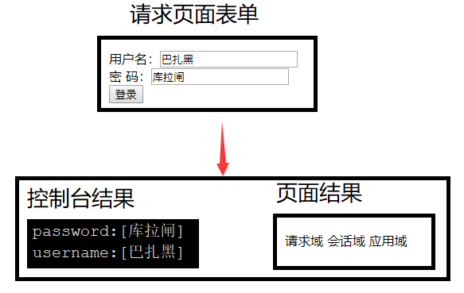

# 在struts 2中调用servlet的API

## 完全解耦合的方式

这种方式是通过struts 2框架提供的ActionContext类的一些方法`间接`的操作servlet的API

### ActionContext常用方法

| 返回值                       | 方法                          | 作用                                                |
| :--------------------------- | :---------------------------- | :-------------------------------------------------- |
| static ActionContext         | getContext()                  | 获取ActionContext实例                               |
| java.util.Map<String,Object> | getParameters()               | 获取请求参数，相当于request.getParameterMap()       |
| java.util.Map<String,Object> | getSession()                  | 获取的代表session域的Map集合，就相当于操作session域 |
| java.util.Map<String,Object> | getApplication()              | 获取代表application域的Map集合                      |
| void                         | put(String key, Object value) | 注意：向request域中存入值                           |

`提示`：获取参数时框架会自动处理乱码

### 示例

下面我们来看一个例子

表单

```jsp
<form action="${pageContext.request.contextPath}/cust_login.action" method="post">
    <label>用户名：</label><input type="text" name="username"><br>
    <label>密 码：</label><input type="text" name="password"><br>
    <input type="submit" value="登录">
</form>
```

结果页面

```jsp
${requestScope.myRequestScope}
${sessionScope.mySessionScope}
${applicationScope.myApplicationScope}
```

struts配置

```xml
<package name="default" namespace="/" extends="struts-default">
    <!--配置Action-->
    <action name="cust_*" class="com.itheima.DemoAction" method="{1}">
        <result name="login">/demo/demo.jsp</result>
    </action>
</package>
```

完全解耦合操作servlet的API的action

```java
public class DemoAction extends ActionSupport {

    public String login() {
        //完全解耦合方式
        ActionContext context = ActionContext.getContext();
        //获取所有请求参数
        Map<String, Object> parameters = context.getParameters();
        //遍历数据
        Set<String> keys = parameters.keySet();
        for (String key : keys) {
            //通过key来获取值，注意值是一个字符串数组（因为复选框会存在多个值）
            String[] values = (String[]) parameters.get(key);
            System.out.println(key + ":" + Arrays.toString(values));
        }

        //向request域中存值,context默认就是向request域中存
        context.put("myRequestScope", "请求域");
        //向其它域中存值
        context.getSession().put("mySessionScope", "会话域");
        context.getApplication().put("myApplicationScope", "应用域");
        return LOGIN;
    }
}
```

我们查看一下结果



## 调用原生servlet API的方式

struts 2框架提供了一个类ServletActionContext，该类中提供了一些静态的方法用来获取原生

servlet对象

### ServletActionContext常用方法

* getPageContext()
* getRequest()
* getResponse()
* getServletContext()

