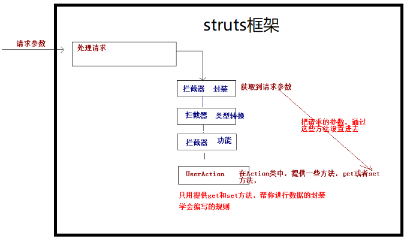

# 数据封装

## 数据封装简介

封装数据为开发提供了很多方便。作为mvc框架，必须要负责解析http请求参数，并将其封装到model对象中struts 2框架提供了很强大的数据封装的功能，不再需要使用servlet的API完成手动封装

struts框架在接收到参数交给action处理之前会先一步交给框架自带的拦截器（interceptor）处理，框架具体有哪些拦截器可参见“struts-default.xml”。数据封装就依赖其中的过滤器



## 数据封装的方式

struts数据封装有两种方式，分别为属性驱动方式和模型驱动方式

### 属性驱动

属性驱动就是可以在action类中直接把要接收的参数设置为同名的成员变量并提供set方法，这样框架就可以自动帮我们给成员变量赋值了。通过这种方法框架就能把参数封装成一个model对象，只不过这个对象就是这个action类本身的实例，当然这种方式不符合mvc设计思想，它把action同时用作model和controller了。而且这种方式如果使用url后带参数的方法访问可能会导致乱码，解决方式还是使用传统方式如过在滤器内界面编码问题

访问界面

```jsp
<form action="${pageContext.request.contextPath}/user.action" method="post">
    <label>姓名：</label><input type="text" name="username"><br>
    <label>密码：</label><input type="text" name="password"><br>
    <label>年龄：</label><input type="text" name="age"><br>
    <input type="submit" value="登录">
</form>
```

配置文件

```xml
<action name="user" class="com.itheima.UserAction">
    <result name="login" type="dispatcher">/demo/demo.jsp</result>
</action>
```

action类

```java
public class UserAction extends ActionSupport {
    private String username;
    private String password;
    private Integer age;

    public void setUsername(String username) {
        this.username = username;
    }

    public void setPassword(String password) {
        this.password = password;
    }

    public void setAge(Integer age) {
        this.age = age;
    }

    @Override
    public String execute() throws Exception {
        System.out.println(username + "-" + password + "-" + age);
        return NONE;
    }
}
```

我们知道把action类当作model使用不符合mvc设计思想，因此我们可以优化这种使用方法，优化的步骤

1. 单独创建一个model对象也就是JavaBean对象

   ```java
   package com.itheima;
   
   public class User {
       private String username;
       private String password;
       private Integer age;
   
       public String getUsername() {
           return username;
       }
   
       public void setUsername(String username) {
           this.username = username;
       }
   
       public String getPassword() {
           return password;
       }
   
       public void setPassword(String password) {
           this.password = password;
       }
   
       public Integer getAge() {
           return age;
       }
   
       public void setAge(Integer age) {
           this.age = age;
       }
   
       @Override
       public String toString() {
           return "User{" +
                   "username='" + username + '\'' +
                   ", password='" + password + '\'' +
                   ", age=" + age +
                   '}';
       }
   }
   ```

   

2. 在action类中将其作为成员变量并提供get和set方法

   ```java
   public class UserAction extends ActionSupport {
       private User user;
   
       public User getUser() {
           return user;
       }
   
       public void setUser(User user) {
           this.user = user;
       }
   
       @Override
       public String execute() throws Exception {
           System.out.println(user);
           return NONE;
       }
   }
   ```

3. 表单提交参数时使用OGNL表达式（属性名前面加所属model对象名）

   ```jsp
   <form action="${pageContext.request.contextPath}/user.action" method="post">
       <!--使用了OGNL表达式-->
       <label>姓名：</label><input type="text" name="user.username"><br>
       <label>密码：</label><input type="text" name="user.password"><br>
       <label>年龄：</label><input type="text" name="user.age"><br>
       <input type="submit" value="登录">
   </form>
   ```

   这样操作以后就能得到同样的效果

### 模型驱动

模型驱动实现步骤

1. action类实现ModelDriven接口并且把要封装的对象类型作为泛型参数传递进去
2. action类中提供要封装的对象类型的成员变量并且必须手动实例化，然后将其作为接口中getModel方法的返回值

JavaBean

```java
package com.itheima;

public class User {
    private String username;
    private String password;
    private Integer age;

    public String getUsername() {
        return username;
    }

    public void setUsername(String username) {
        this.username = username;
    }

    public String getPassword() {
        return password;
    }

    public void setPassword(String password) {
        this.password = password;
    }

    public Integer getAge() {
        return age;
    }

    public void setAge(Integer age) {
        this.age = age;
    }

    @Override
    public String toString() {
        return "User{" +
                "username='" + username + '\'' +
                ", password='" + password + '\'' +
                ", age=" + age +
                '}';
    }
}
```

action类

```java
public class UserAction extends ActionSupport implements ModelDriven<User> {

    private User user = new User();

    @Override
    public User getModel() {
        return user;
    }

    @Override
    public String execute() throws Exception {
        System.out.println(user);
        return NONE;
    }
}
```

访问页面

```jsp
<form action="${pageContext.request.contextPath}/user.action" method="post">
    <label>姓名：</label><input type="text" name="username"><br>
    <label>密码：</label><input type="text" name="password"><br>
    <label>年龄：</label><input type="text" name="age"><br>
    <input type="submit" value="登录">
</form>
```

struts配置

```xml
<action name="user" class="com.itheima.UserAction">
    <result name="login" type="dispatcher">/demo/demo.jsp</result>
</action>
```

## 数据封装到集合中的方式

### 向List集合中封装数据

向List集合中封装数据，默认情况下会使用属性驱动的方式，步骤如下

1. 在action中设置集合对象并提供get和set方法
2. 在表单中提交的参数的名称前面加集合与对应下标

示例

action中设置集合对象

```java
public class UserAction extends ActionSupport {

    private List<User> userList;

    public List<User> getUserList() {
        return userList;
    }

    public void setUserList(List<User> userList) {
        this.userList = userList;
    }

    @Override
    public String execute() throws Exception {
        System.out.println(userList);
        return NONE;
    }
}
```

参数的名称前面加集合与对应下标

```jsp
<form action="${pageContext.request.contextPath}/user.action" method="post">
    <label>姓名：</label><input type="text" name="userList[0].username"><br>
    <label>密码：</label><input type="text" name="userList[0].password"><br>
    <label>年龄：</label><input type="text" name="userList[0].age"><br>


    <label>姓名：</label><input type="text" name="userList[1].username"><br>
    <label>密码：</label><input type="text" name="userList[1].password"><br>
    <label>年龄：</label><input type="text" name="userList[1].age"><br>
    <input type="submit" value="登录">
</form>
```

这样就能将数据封装到集合当中去了

### 向Map集合中封装数据

向Map集合中封装数据和向List集合中封装数据差不多，只不过在表单中提交的参数的名称前面加集合与对应的key

```java
public class UserAction extends ActionSupport {

    private Map<String, User> userMap;

    public Map<String, User> getUserMap() {
        return userMap;
    }

    public void setUserMap(Map<String, User> userMap) {
        this.userMap = userMap;
    }

    @Override
    public String execute() throws Exception {
        System.out.println(userMap);
        return NONE;
    }
}
```

表单中提交的参数的名称前面加集合与对应的key

```jsp
<form action="${pageContext.request.contextPath}/user.action" method="post">
    <label>姓名：</label><input type="text" name="userMap['one'].username"><br>
    <label>密码：</label><input type="text" name="userMap['one'].password"><br>
    <label>年龄：</label><input type="text" name="userMap['one'].age"><br>


    <label>姓名：</label><input type="text" name="userMap['two'].username"><br>
    <label>密码：</label><input type="text" name="userMap['two'].password"><br>
    <label>年龄：</label><input type="text" name="userMap['two'].age"><br>
    <input type="submit" value="登录">
</form>
```