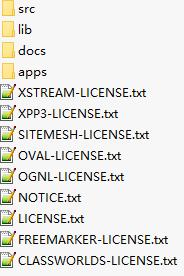
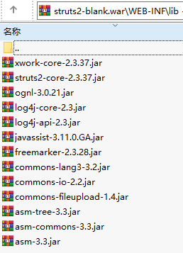

# Struts 2入门

## 基础问题

### struts 2是什么

> 百度百科：Struts2是一个基于MVC设计模式的Web应用框架，它本质上相当于一个servlet，`在MVC设计模式中，Struts2作为控制器`(Controller)来建立模型与视图的数据交互。Struts 2是Struts的下一代产品，是在 struts 1和WebWork的技术基础上进行了合并的全新的Struts 2框架。其全新的Struts 2的体系结构与Struts 1的体系结构差别巨大。Struts 2以WebWork为核心，采用拦截器的机制来处理用户的请求，这样的设计也使得业务逻辑控制器能够与ServletAPI完全脱离开，所以Struts 2可以理解为WebWork的更新产品。虽然从Struts 1到Struts 2有着太大的变化，但是相对于WebWork，Struts 2的变化很小。

### 什么要使用struts 2

Struts 2是实现MVC的框架，而之所以采用MVC模式，是为了将表现层和逻辑层分开。之所以要分层，是为了让程序各部分之间解耦合。之所以要解耦合，是为了系统扩展和维护方便。之所以要系统扩展和维护方便，是为了降低成本。

### struts 2有什么功能

struts 2主要的`功能就是接收分发用户发来的请求`，它的`核心就是servlet中的过滤器`，因此使用struts 2的时候必须要在web.xml中配置核心的过滤器

## 环境准备

### struts 2下载地址

https://struts.apache.org/

### 选择需要的依赖包

下载完对应版本的struts项目后，打开可以看到



其中lib目录中有struts 2框架所有的jar包，但是这其中并不是所有的jar包我们都需要使用，因为这些jar包是为了支持一些插件或者整合其它框架所需要的。为了不使我们的项目冗余，我们需要去apps目录中找一个示例项目选择这个项目所依赖的jar包，我们可以看到这个比lib目录中的jar少多了，我们使用这些jar包就可以了



### 配置核心过滤器

找到web.xml，在web-app元素下配置如下过滤器。这个过滤器同样可以在刚下载的struts项目中示例项目的web.xml文件中找到，复制即可

```xml
<filter>
    <filter-name>struts2</filter-name>
    <filter-class>org.apache.struts2.dispatcher.ng.filter.StrutsPrepareAndExecuteFilter</filter-class>
</filter>

<filter-mapping>
    <filter-name>struts2</filter-name>
    <url-pattern>/*</url-pattern>
</filter-mapping>
```
## 使用struts 2

我们知道struts 2的工作流程就是按在struts配置文件中配置的信息来将用户发来的请求分发给对应的action（struts中处理请求的类）处理

### 编写action

action就是处理请求的类，我们习惯将其类名后缀统一为Action

为了框架正常执行，action中的方法有如下要求

1. 访问权限修饰符必须为public
2. 返回值必须有且必须为String类型
3. 不能有参数列表

```java
//示例
public class HelloAction {
    public String sayHello() {
        System.out.println("struts 2执行...");
        return "ok";
    }
}
```

### 编写struts配置文件

我们需要使用配置文件来告诉框架请求和处理请求的action之间的对应关系，默认情况下配置文件名称必须为struts.xml，且该文件放在必须放在src根目录中。结构如下

```xml
<?xml version="1.0" encoding="UTF-8"?>
<!DOCTYPE struts PUBLIC
        "-//Apache Software Foundation//DTD Struts Configuration 2.3//EN"
        "http://struts.apache.org/dtds/struts-2.3.dtd">
<!--注意上面的是struts文档的约束，有了这个就可以让编辑器提示-->

<!--示例-->
<struts>
    <!--包结构-->
    <package name="default" namespace="/" extends="struts-default">
        <!--配置Action-->
        <action name="hello" class="com.itheima.HelloAction" method="sayHello">
            <!--配置跳转界面-->
            <result name="ok">/demo/success.jsp</result>
        </action>
    </package>
</struts>
```

比如我们的请求页面为

```jsp
<%@ page contentType="text/html;charset=UTF-8" language="java" %>
<html>
<head>
    <title>demo</title>
</head>
<body>
    <h1>struts2测试</h1>
    <h1>${pageContext.request.contextPath}</h1>
    <a href="${pageContext.request.contextPath}/hello.action">test</a>
</body>
</html>
```

可以见到我们的请求的url为“/hello.action”。struts配置文件中package元素的namespace属性和action元素的name属性组合就对应请求url（url后缀名为action时可省略）

action元素的class属性为请求对应的处理类，method是类中具体要处理请求的方法

result元素的name属性对应的是处理类返回的结果字符串，也就是处理类中的方法的返回值。result元素的内容是拿到对应结果字符串后跳转的结果页面