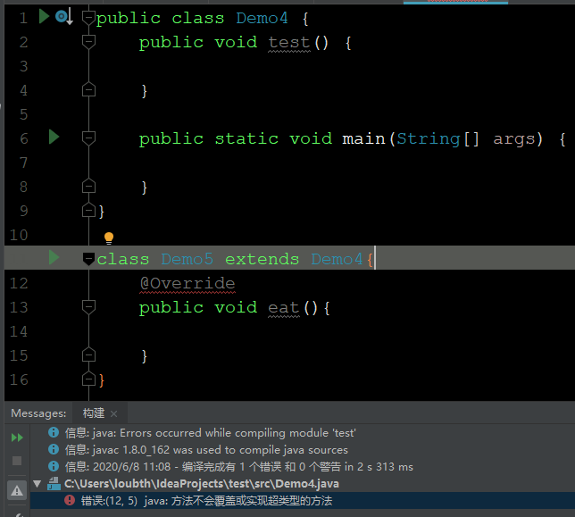
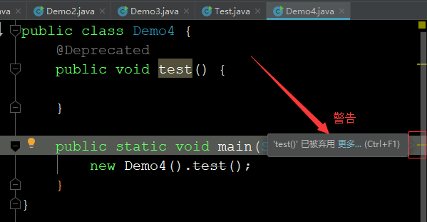
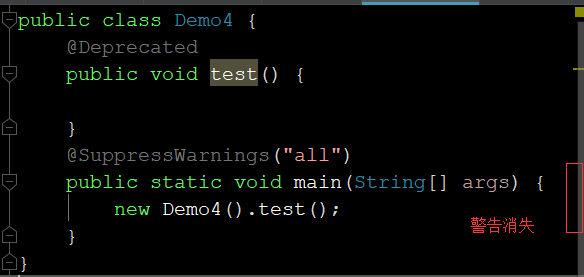
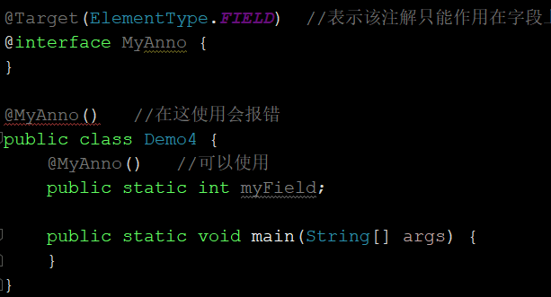

# 注解

## 基础问题

### 注解是什么

Java注解（Annotation）是JDK 1.5引入的一种注释机制，就像**注释**是给程序员看的解释程序的文字说明，可以把**注解**理解为给程序本身看的文字说明

> 百度百科定义：注解（Annotation）是Java元数据，一种代码级别的说明。它是JDK 1.5及以后版本引入的一个特性，与类、接口、枚举是在同一个层次。它可以声明在包、类、字段、方法、局部变量、方法参数等的前面，用来对这些元素进行说明，注释。

### 为什么要使用注解

注解是用来在某些时候**代替配置文件**的。我们知道XML是一种与代码是松耦合关系的代码描述，XML配置文件也就是为了分离代码和配置而引入的，但是有时候它维护起来很麻烦。有时候我们希望使用一些和代码紧耦合的东西来描述代码。注解就是一种与代码紧耦合的代码描述工具。这两者各有利弊

### 注解有什么功能

1. 编译检查：通过代码里标识的元数据让编译器能够实现基本的编译检查，比如重写方法时使用的**Override**
2. 编写文档：通过代码里标识的元数据生成文档，比如**param**
3. 代码分析：通过代码里标识的元数据对代码进行分析，比如使用框架时的各种注解

## Java中预定义的注解

1. Override：重写的意思，作用是检测方法是否是重写父类的方法，如果不是，编译会报错无法通过

   

2. Deprecated：弃用的意思，标识一个东西已经过时不推荐使用。强行使用只会警告，但是不影响使用

   

3. SuppressWarnings：压制警告，如果你不想看到编辑器的警告，那你使用这个注解，编辑器将不再警告。注意这个注解需要传递参数，一般传递“all”

   

## 自定义注解

### 格式

```java
元注解
public @interface 注解名称{}
```

### 注解的本质

我们定义一个注解MyAnno通过反编译可得“public interface MyAnno extends java.lang.annotation.Annotation {}”，由此我们能知道**注解的本质就是一个继承自“java.lang.annotation.Annotation”接口的接口**

### 注解内可以定义的内容

因为注解本质上是接口，所以注解内部可以定义的内容几乎和接口一样。但是注解中的方法返回值有限制，只能是以下几种

1. 基本数据类型
2. String
3. 枚举
4. 注解
5. 以上类型的数组

我们把注解中定义的方法叫做**注解的属性**

提示：

1. 如果一个注解有属性，使用的时候就需要为属性赋值（有默认值的除外），没有属性的话不用赋值而且可以省略后面的括号
2. 如果一个注解只有一个唯一的属性且名称为value，那么使用时为其赋值可以省略“value=”
3. 属性为数组的时候要使用大括号括起来，如果数组只有一个值则可以省略

```java
@MyAnno(name = "loubth", height = 9)
@MyAnno2("hello")   //省略value=
@MyAnno3({"what", "why"})   //多个值需要使用大括号
@MyAnno4("hi")  //只有一个值省略大括号
public class Demo4 {
    public static void main(String[] args) {
    }
}

@interface MyAnno {
    String name();

    int age() default 25;

    int height();
}

@interface MyAnno2 {
    String value();
}

@interface MyAnno3 {
    String[] value();
}

@interface MyAnno4 {
    String[] value();
}
```

### 元注解

定义：描述注解本身的注解。

下面我们介绍一下预定义的元注解

1. Target：描述注解能够起作用的位置（比如类、方法）

   

   注意**ElementType**是一个枚举，它有几个表示作用范围的取值，常用的取值如下，更多请参照[详细信息](image/注解/注解详解.jpg)

   * 类：TYPE

   * 字段：FIELD

   * 方法：METHOD

   提示：如果不指定默认情况下自定义注解能在任何元素上使用

2. Retention：保留，描述注解被保留的阶段（源码、字节码文件、runtime环境）

   ```java
   @Retention(RetentionPolicy.RUNTIME)
   @interface MyAnno {
   }
   ```

   注意**RetentionPolicy**是一个枚举，它有几个表示注解保留的阶段的取值，可用的取值如下

   * 源码：SOURCE
   * 字节码文件：CLASS
   * 虚拟机运行时环境：RUNTIME

   提示：如果不指定默认情况下默认值为CLASS，我们自定义注解的时候一般使用RUNTIME

3. Documented：描述注解是否被抽取到API文档

   ```java
   @Documented
   @interface MyAnno {
   }
   ```

   使用该注解的类其生成的API文档中可以查看到该注解

4. Inherited：描述注解是否被子类继承

   ```java
   @Inherited
   @interface MyAnno {
   }
   ```

   使用该注解的类的子类会自动继承该注解

## 解析注解

学完上面的定义注解，你肯定会产生疑问，在注解中定义了一堆属性，有啥用呢？怎么用的这些属性，接下来就来介绍

### 解析注解的方法

我们使用注解的方式其实就是通过反射得到注解提供的信息

解析注解（获取注解中定义的属性值）的步骤如下

1. 获取对应位置的注解信息
2. 调用方法获取注解的属性值

```java
/**
 * 描述需要执行的类名和方法名
 */
@Target(ElementType.TYPE)
@Retention(RetentionPolicy.RUNTIME)
@interface MyAnno {
    String className();
    String methodName();
}

class MyPrint {
    public void print() {
        System.out.println("MyPrint.print is running...");
    }
}

@MyAnno(className = "MyPrint", methodName = "print")
public class Demo4 {

    public static void main(String[] args) throws Exception {
        //获取注解信息
        MyAnno anno = Demo4.class.getAnnotation(MyAnno.class);
        String className = anno.className();
        String methodName = anno.methodName();
        System.out.println(className);
        System.out.println(methodName);

        //采用反射执行方法
        Class cls = Class.forName(className);
        Object obj = cls.newInstance();
        Method method = cls.getMethod(methodName);
        method.invoke(obj);
    }
}


//---------------------------------------------
//结果
//MyPrint
//print
//MyPrint.print is running...
```

## 教学视频

[教学视频](https://www.bilibili.com/video/BV1Vt411g7RP)

